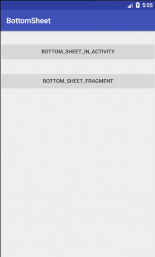

# android 底部弹出可拖动菜单

使用android原生控件 [CoordinatorLayout](https://developer.android.com/reference/android/support/design/widget/CoordinatorLayout.html) 和 [NestedScrollView](https://developer.android.com/reference/android/support/v4/widget/NestedScrollView.html) 实现

效果如下:

